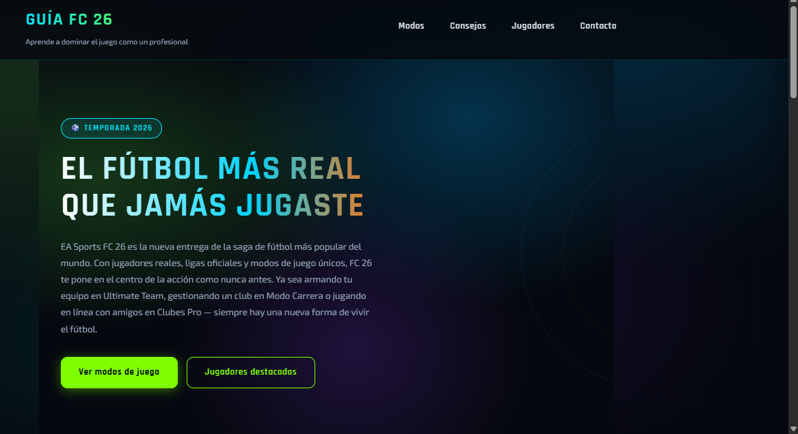
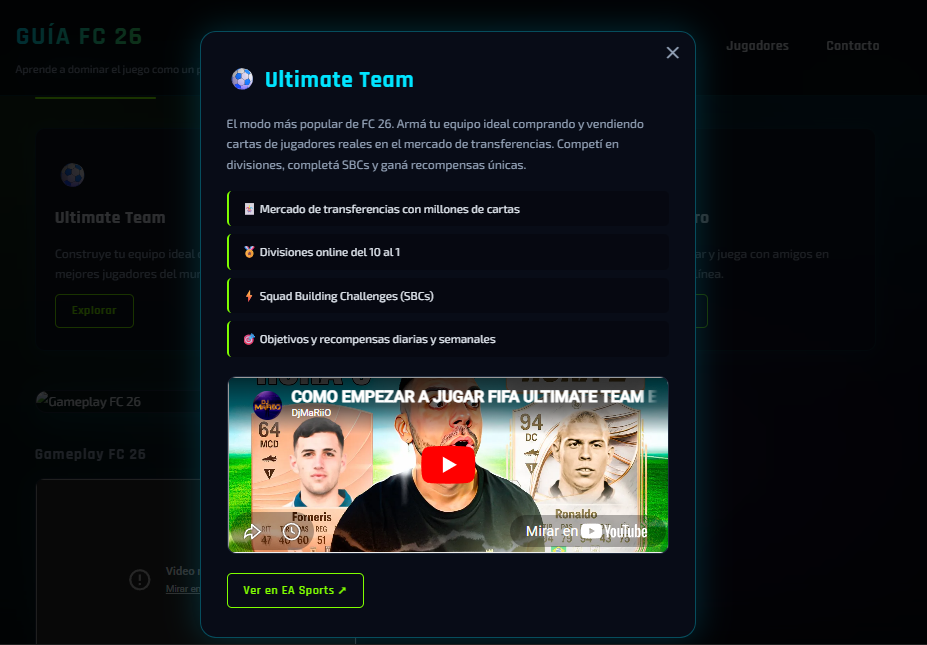

# Guía FC 26 🎮⚽

Una guía interactiva sobre EA Sports FC 26, desarrollada como proyecto cuatrimestral para la materia Programación III - 2° Año UTN.

## Capturas

## Tecnologías utilizadas

- HTML5
- CSS3
- Google Fonts (Rajdhani, Exo 2)
- Git y GitHub

## Mejoras visuales incorporadas

- Diseño responsive adaptado a tablet (768px) y celular (480px)
- Paleta de colores inspirada en FC 26 con fondo oscuro y acentos en verde neón y celeste
- Layout con Flexbox en header, navegación, hero y formulario
- Layout con CSS Grid en sección de modos de juego y jugadores destacados
- Modales con CSS :target para mostrar información de cada modo de juego y consejo
- Cartas de jugadores estilo FC 26 con imágenes reales
- Sección hero con fondo de manchas de color tipo aurora
- Animaciones con @keyframes y transiciones suaves en botones, cards y cartas
- Variables CSS en :root para colores, fuentes y sombras